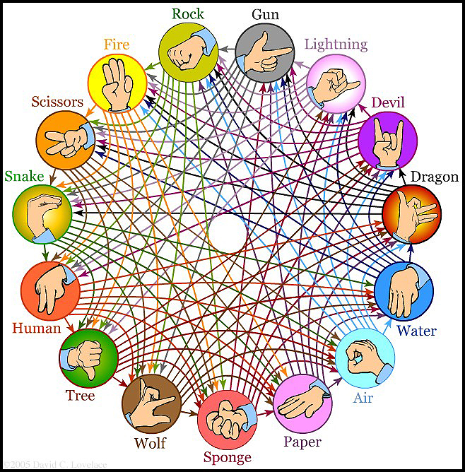

MultiVariabled so-called Rock Scissors Paper Game
==============

Fall 2020

*Python 3.9.0*

Representation of the Options
------------

If you’ve ever wanted to create games, this project will get you started! In this project you will code a Rock-Paper-Scissors-Lizard-Spock game, a more advanced version of Rock-Paper-Scissors, which can be played against the computer.

Run Command:
------------
	python rock-scissors-paper.py

	Enter a name and choose the options want to you play with otherwise if you do not chooce any, program will give you the conventional options.
	- Randomly selected computer choices
	- 

What I learned:

  how to use different sides of the random library
