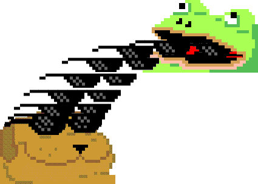
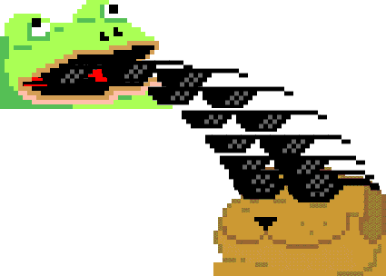

# Learning-materials
## Directories
   - [Competitions](Competitions)
   - [Data Mining](Data-Mining)
   - [Deep Learning](Deep-Learning)
   - [Mobile Application](Mobile-Application)
   - [Optimization](Optimization)
   - [Programming](Programming)
   - [Project Management]("Project Management")
   - [Tools](Tools)
   - [User Interface](User-Interface)
   - [WEB](Web)

I decided to create this repository to keep track of what I have done throughout my learning process on various subjects. Maybe one day this repo make me smile 🥲 
---
    
    
   
   
